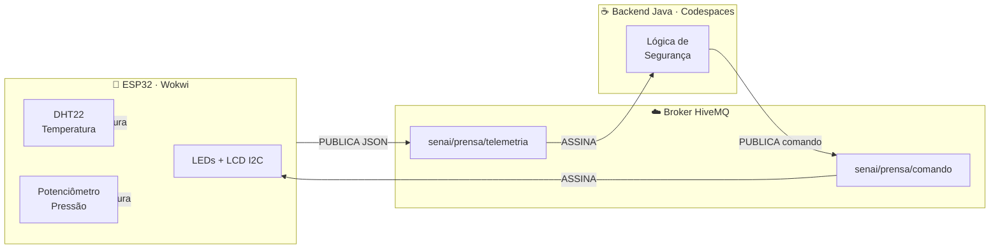

<div align="center">

# ⚡ Prensa Hidráulica — Sistema de Monitoramento IoT

**Telemetria bidirecional em tempo real via MQTT · ESP32 + Java · Wokwi + GitHub Codespaces**

[]()
[](https://www.hivemq.com)
[](https://wokwi.com/projects/456753261676440577)
[]()
[]()

<br/>

> Sistema embarcado de monitoramento industrial que coleta temperatura e pressão de uma prensa hidráulica,
> processa os dados via backend Java e aciona alertas visuais (LEDs + LCD) em tempo real.

<br/>

[🔴 **Simulação ao vivo no Wokwi**](https://wokwi.com/projects/456753261676440577) · [📦 **Repositório Java**](https://github.com/ryhanschutz/Projeto_ESP32_MQTT_JAVA)

</div>

---

## 🧠 Como funciona



---

## 🚦 Lógica de Segurança

| Status | LED | Condição |
|:------:|:---:|----------|
| 🟢 **SEGURO** | Verde | `Temp < 45°C` **AND** `Pressão < 50%` |
| 🟡 **ALERTA** | Amarelo | `Temp 45–60°C` **OR** `Pressão 50–80%` |
| 🔴 **CRÍTICO** | Vermelho | `Temp > 60°C` **OR** `Pressão > 80%` |

> [!IMPORTANT]
> O estado **VERMELHO** é verificado **antes** do AMARELO na lógica Java.
> Inverter essa ordem causaria falha silenciosa — a máquina em colapso exibiria LED amarelo.

---

## 🛠️ Stack

```
Camada de Hardware    →   ESP32 + DHT22 + Potenciômetro + LEDs + LCD I2C (Wokwi)
Camada de Protocolo   →   MQTT 3.1.1 · broker.hivemq.com:1883 · QoS 1
Camada de Backend     →   Java 11 · Maven · Eclipse Paho MQTT v1.2.5
Camada de Dev         →   GitHub Codespaces · VS Code · C++ (Arduino framework)
```

---

## 📡 Tópicos MQTT

| Tópico | Direção | Payload |
|--------|---------|---------|
| `senai/prensa/telemetria` | ESP32 → Java | `{"temperatura":38.5,"pressao":42}` |
| `senai/prensa/comando` | Java → ESP32 | `VERDE` \| `AMARELO` \| `VERMELHO` |

---

## 🔌 Pinout ESP32

| Componente | GPIO | Observação |
|-----------|------|------------|
| DHT22 | `15` | Temperatura e umidade |
| Potenciômetro | `34` | ADC somente leitura — simula pressão |
| LED Verde | `26` | Estado SEGURO |
| LED Amarelo | `27` | Estado ALERTA |
| LED Vermelho | `14` | Estado CRÍTICO |
| LCD SDA | `21` | I2C padrão ESP32 · endereço `0x27` |
| LCD SCL | `22` | I2C padrão ESP32 |

---

## 🚀 Como rodar

### ESP32 — Wokwi
Acesse o link da simulação e clique em **▶ Start Simulation**:

🔗 [wokwi.com/projects/456753261676440577](https://wokwi.com/projects/456753261676440577)

### Backend Java — Codespaces

```bash
# Clone o repositório
git clone https://github.com/ryhanschutz/Projeto_ESP32_MQTT_JAVA

# Entre na pasta
cd Projeto_ESP32_MQTT_JAVA

# Compile e execute
mvn compile exec:java -Dexec.mainClass="br.com.senai.AppPrensa"
```

> [!TIP]
> Execute o Wokwi **antes** de rodar o Java para já ter dados chegando no broker quando o backend conectar.

---

## 📁 Estrutura do Projeto

```
Projeto_ESP32_MQTT_JAVA/
├── 📄 pom.xml                          # Dependências Maven (Paho MQTT)
└── src/
    └── main/
        └── java/
            └── br/com/senai/
                └── ☕ AppPrensa.java   # Backend principal
```

---

## 🔒 Segurança

> [!WARNING]
> Este projeto usa o broker público HiveMQ **sem criptografia** — adequado apenas para desenvolvimento.

Em produção, recomenda-se:
- Broker privado (Eclipse Mosquitto) com **TLS/SSL** na porta `8883`
- Autenticação por certificado de cliente
- Controle de acesso por tópico (ACL)
- Conformidade com **IEC 62443**

---

## 🏭 Visão Industrial

Em um ambiente industrial real, este sistema escalaria para:

```
Sensores industriais  →  PT100 (temperatura) · Turck PS+ IO-Link (pressão)
Controlador           →  CLP Siemens S7-1500 · Schneider Modicon · WEG TPW-03
Protocolo de campo    →  Modbus TCP/IP · PROFINET · IO-Link
Supervisório          →  SCADA (Wonderware / AVEVA) via OPC-UA
Nuvem IIoT            →  HiveMQ Enterprise · AWS IoT · Azure IoT Hub
```

---

## 👤 Autor

<div align="center">

**Ryhan Gabriel Schutz**
<br/>
Técnico em CiberSistemas · SENAI CentroWEG · Jaraguá do Sul, SC
<br/><br/>

[](https://github.com/ryhanschutz)

<br/>

*Projeto desenvolvido como avaliação prática da Unidade Curricular*
*Programação para Coleta de Dados em Automação — 2026*

</div>